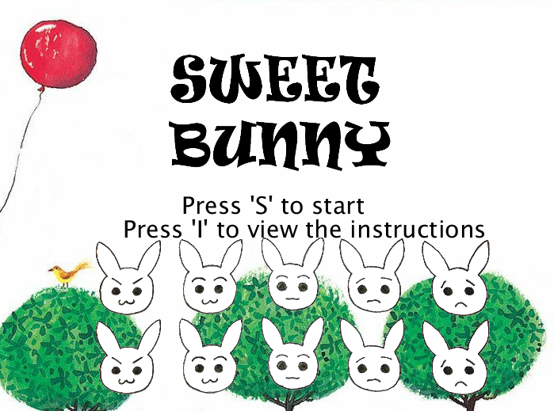

# Sweet Bunny
A bunny who's really into sweets. Help him get the sweets!

http://mandychen.me/sweetbunny/




## Source Code

### JavaScript Source Code

I rewrote my old code (in Processing) to a new JavaScript file, [sweetbunny.js](./docs/sweetbunny.js) so that I can embed it on my website. I also cleaned up repetitive and redundant code during the process.


### Processing Source

The Processing source code file, [sweetbunny.pde](./sweetbunny.pde) was written in 2015. You can run it on the Processing Development Environment (PDE). Get PDE either on [Processing's website](https://processing.org/download/),
or use a package manager like [homebrew](https://brew.sh/) and run

```bash
$ brew cask install processing
```

After installing, open PDE, clone this repo and open `sweetbunny.pde` from PDE, and click the run button on the top left corner.

### Develop Locally

Use `php` built-in web server.

Navigate to `./docs` directory and run

```bash
$ php -S localhost:8000
```

to start server locally at `http://localhost:8000`.

## About the Processing Programming Language

The Processing language builds on the Java language[1]. The syntax is Java-like. Go to their [website](https://processing.org/) or [GitHub repo](https://github.com/processing/processing)
if you are interested.

[1] https://en.wikipedia.org/wiki/Processing_(programming_language)
